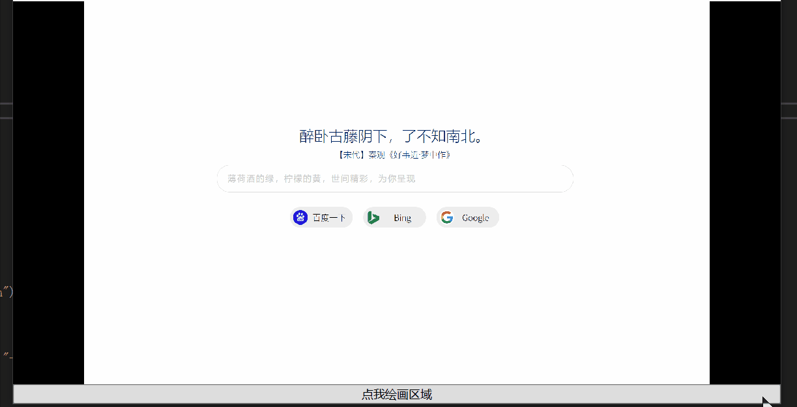
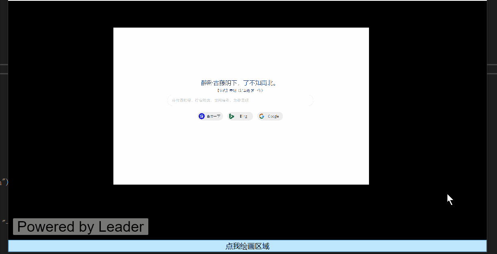
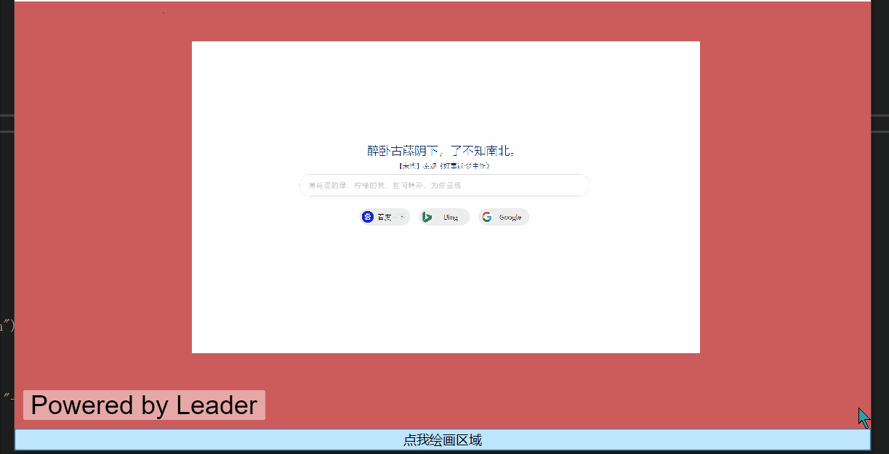
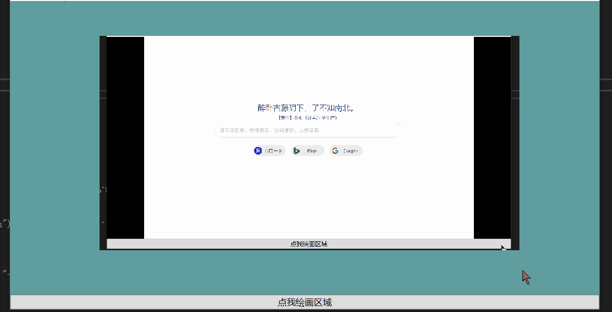

# BingVision

WPF下的图像显示控件封装。

# 使用
**需对HandyControl进行引用。** 

更多精彩，尽在右键。

初步具备以下功能：

- 读取保存图像
- 拖动图像
- region选择margin还是fill显示
- 窗口背景显示
- 相机相关操作

控件可以单独使用，也可绑定相机使用。

## 相关操作

# 代码贡献
热烈欢迎对本项目的代码提出改进意见。

# 特别感谢
暂无

# 许可证
暂无
